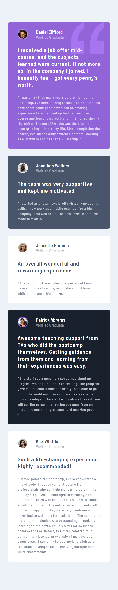
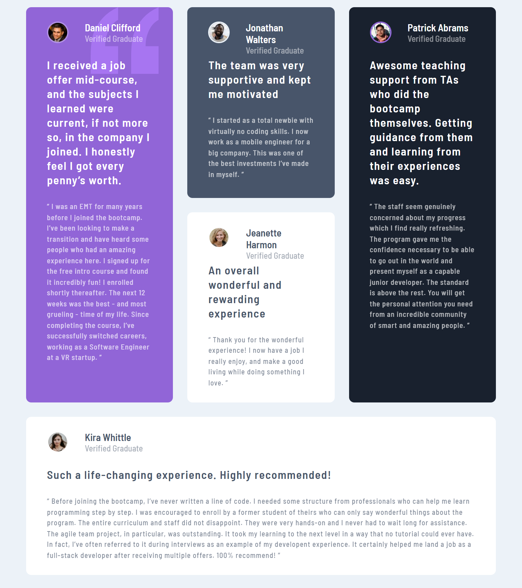
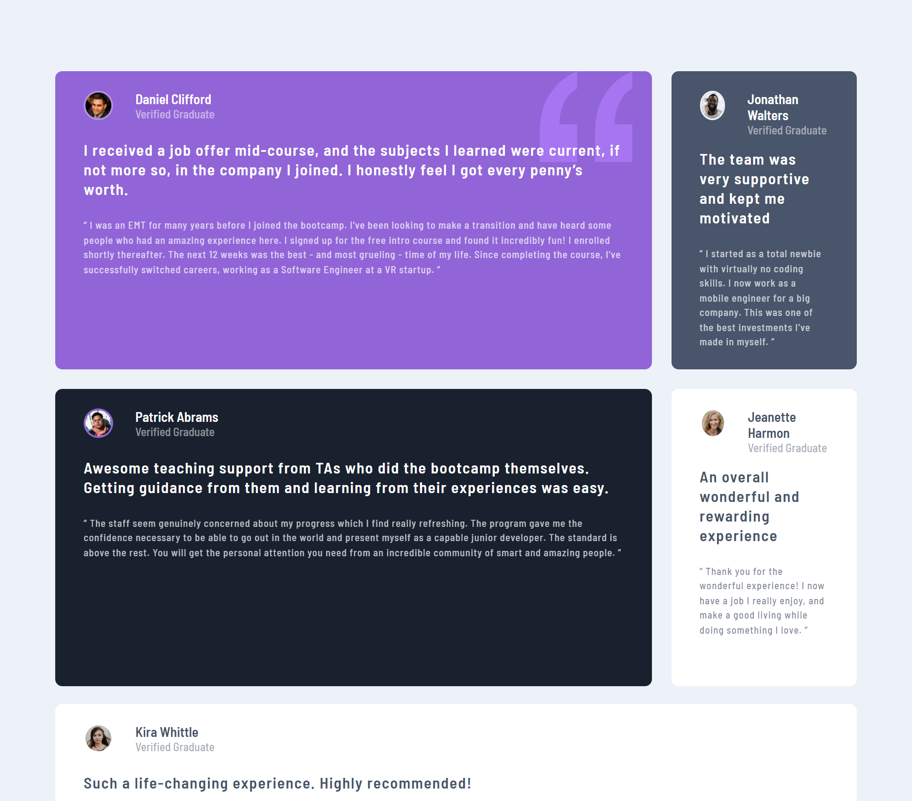
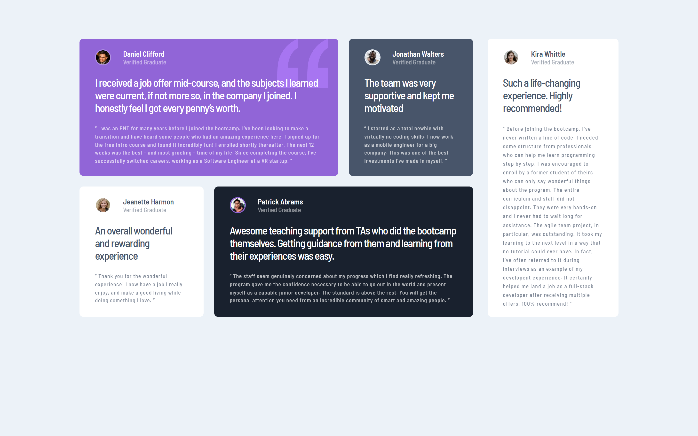

Hi everybody! 👋

# Frontend Mentor - Testimonials grid section solution

This is a solution to the [Testimonials grid section challenge on Frontend Mentor](https://www.frontendmentor.io/challenges/testimonials-grid-section-Nnw6J7Un7).

## Table of contents

- [Frontend Mentor - Testimonials grid section solution](#frontend-mentor---testimonials-grid-section-solution)
  - [Table of contents](#table-of-contents)
  - [Overview](#overview)
    - [The challenge  🎯](#the-challenge--)
    - [Links  🔗](#links--)
  - [My process ⚙️](#my-process-️)
    - [Built with 🛠️](#built-with-️)
  - [Author  🙋🏻‍♂️](#author--️)

## Overview

### The challenge  🎯

Users should be able to:

- View the optimal layout for the site depending on their device's screen size

Mobile Layout 📱

800px Layout 💻

800px Layout 💻

Desktop Layout 💻

### Links  🔗

- Solution URL: [Github Repository](https://github.com/Arfirpo/testimonials-grid-section-main)
- Live Site URL: [Github Page](https://arfirpo.github.io/testimonials-grid-section-main/)

## My process ⚙️

### Built with 🛠️

- Semantic HTML5 markup
- CSS custom properties
- Flexbox
- CSS Grid
- Mobile-first workflow

## Author  🙋🏻‍♂️

- Twitter/X - [@agus_firpo](https://twitter.com/agus_firpo)
- Frontend Mentor - [@Arfirpo](https://www.frontendmentor.io/profile/Arfirpo)
- Linkedin - [Agustín Rodrigo Firpo](https://www.linkedin.com/in/agustin-rodrigo-firpo-0aa86697/)
